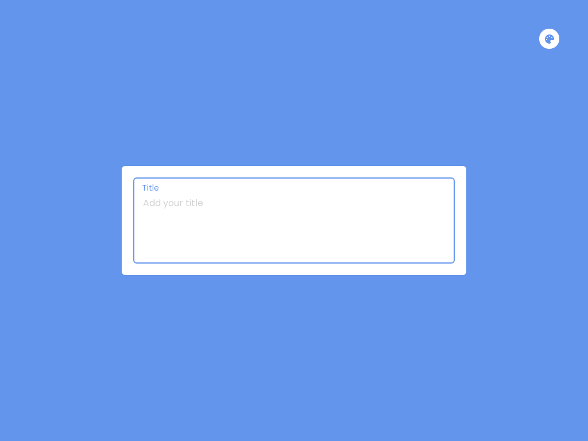

# JS-CharacterLimit

Character limit using HTML, CSS and JavaScript
<a href = "https://issakass.github.io/JS-CharacterLimit/">↪ Live Demo</a>

- Well designed user interface using HTML and CSS.
- Type the text inside the textarea. If the text length exceeds 100, it will show an error.
- Click on the theme button (top right corner) to open the theme menu. Click on a color to change the background.
